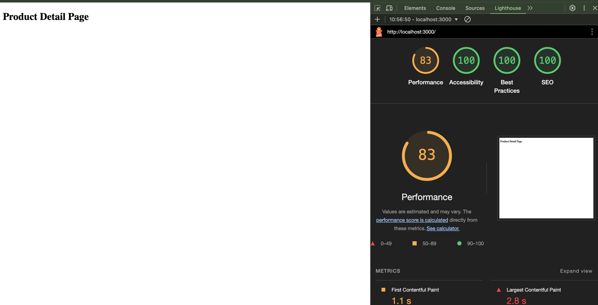

# Microfrontends in Next.js

## What are Microfrontends?

Microfrontends are an architectural style where a frontend app is decomposed into smaller, semi-independent "micro apps" working loosely together. This approach extends the concept of microservices to frontend development.

## Microfrontends in Next.js

Next.js, a popular React framework, can be used to implement microfrontends. Here's how it works:

1. **Separate Next.js Apps**: Each microfrontend is a separate Next.js application.

2. **Module Federation**: Next.js uses Webpack's Module Federation to share code between these apps.

3. **Runtime Integration**: Microfrontends are loaded and integrated at runtime, not build time.

## Benefits

- **Independent Development**: Teams can work on different parts of the app independently.
- **Technology Flexibility**: Different microfrontends can use different versions of libraries or even different frameworks.
- **Scalability**: Easier to scale development across multiple teams.

## Implementation Example

Here's a basic example of how you might set up a microfrontend in Next.js:

reference: https://github.com/module-federation/module-federation-examples/blob/master/nextjs-v14/shop/package.json